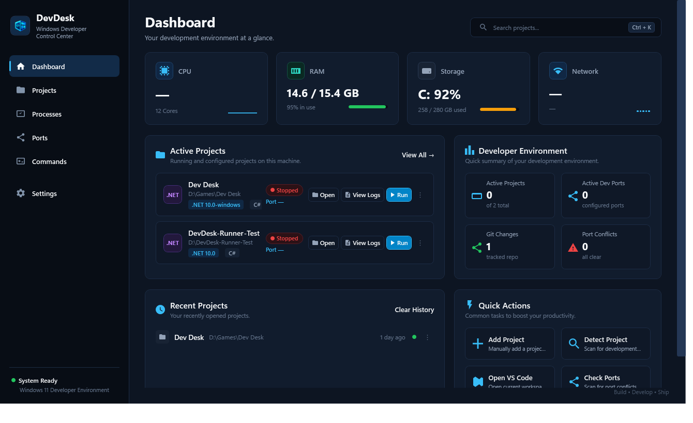
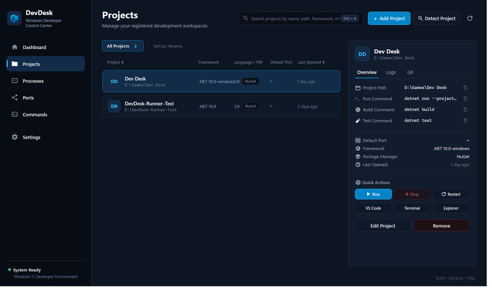
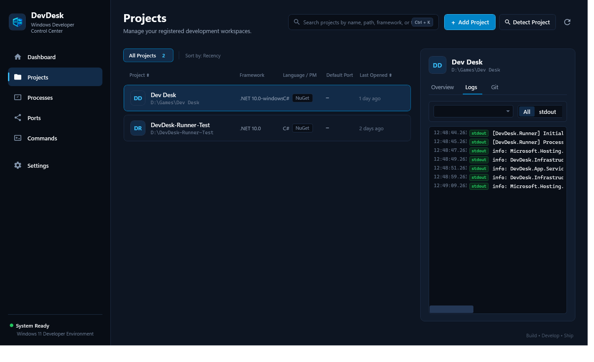
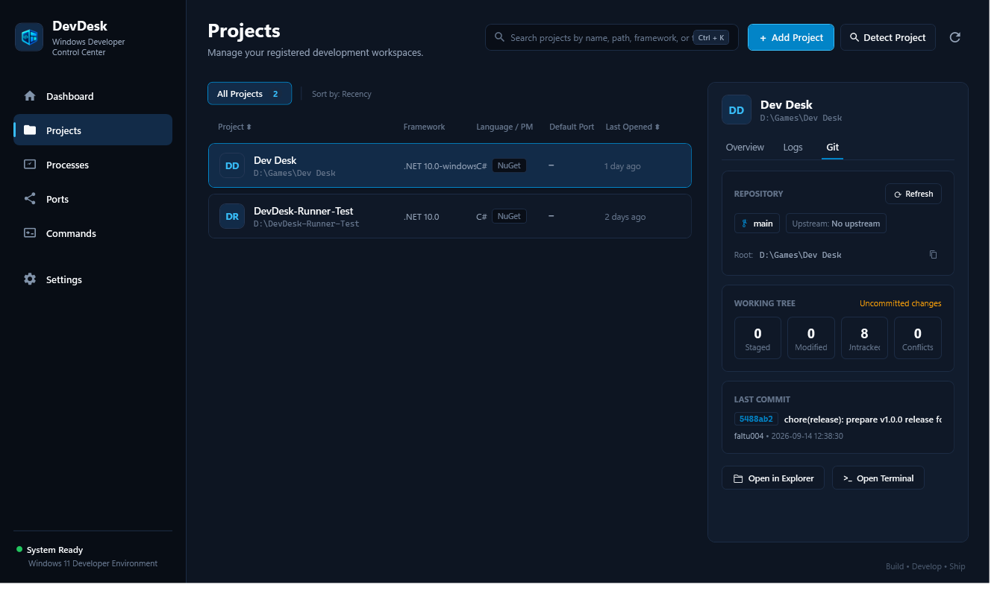
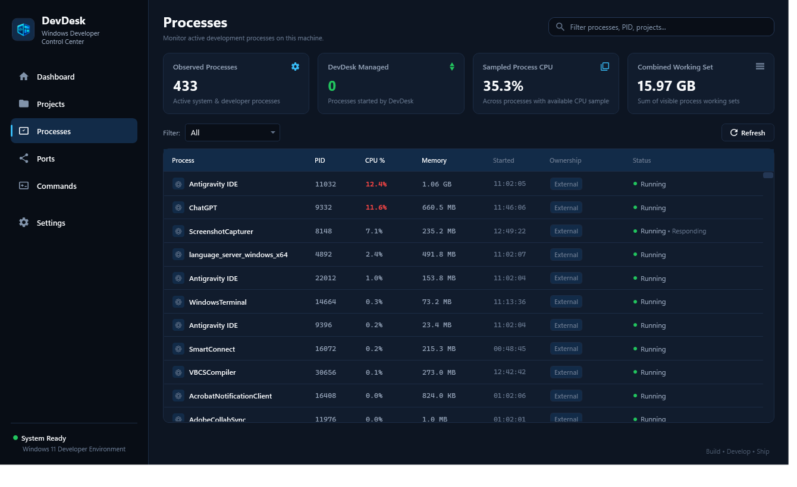
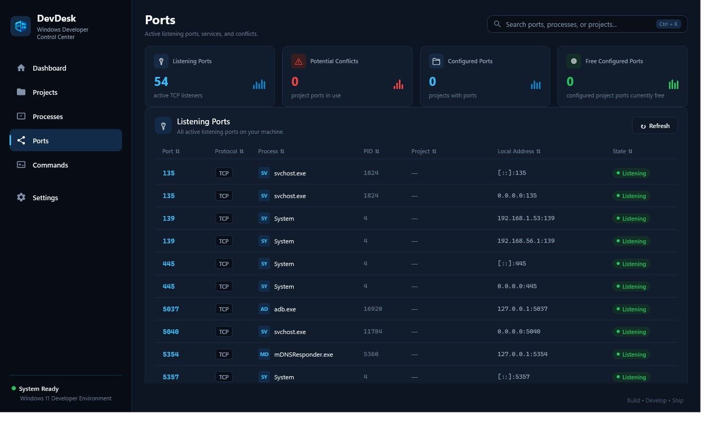
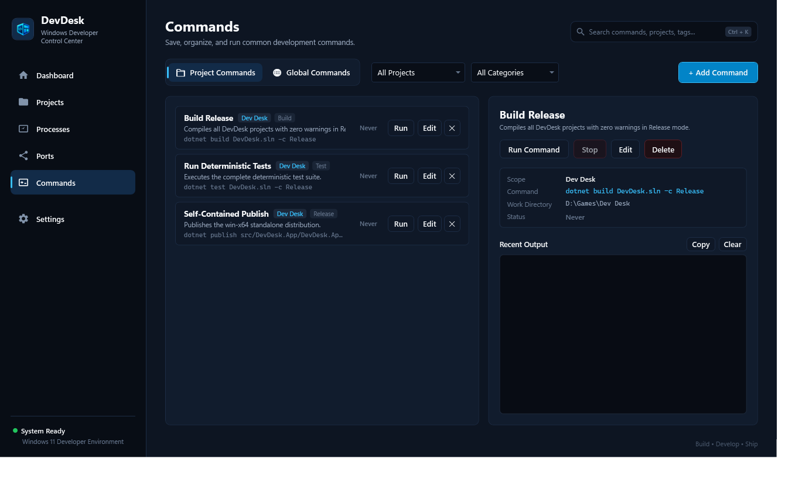
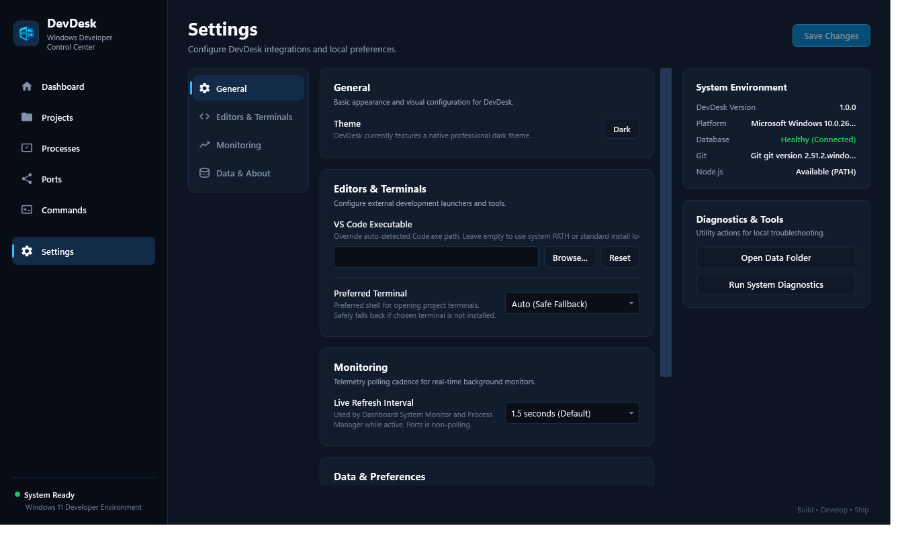

# DevDesk
Windows Developer Control Center

A local-first Windows desktop application for managing developer projects, processes, ports, Git state, saved commands, project execution, logs, and machine telemetry from one workspace.

---

## Screenshots

### Dashboard


### Projects & Workspaces


### Live Runner Logs & Streaming Output


### Read-Only Git Integration


### System Process Inspector


### TCP Port & Conflict Inspector


### Saved Commands & Structured Execution


### Settings & Environment Diagnostics


---

## Why DevDesk

Modern software engineering on Windows involves constant context switching between fragmented utilities:
- **Terminal Windows**: Multiple PowerShell, Command Prompt, or bash tabs hosting dev servers and watchers.
- **Windows Task Manager**: Hunting down orphaned processes or tracking memory/CPU spikes.
- **Port Inspection Utilities**: Manually running `netstat`, `Get-NetTCPConnection`, or CurrPorts to find which PID is locking port 3000 or 5000.
- **Git Clients & CLI**: Constantly checking branch status, dirty files, and unpushed commits across repositories.
- **Code Editors & File Explorer**: Launching projects in VS Code or locating files on disk.
- **Log Viewers**: Tailing erratic console logs across disconnected terminals.

DevDesk unifies these development activities into a single, cohesive, local-first control center tailored specifically for daily software engineering workflows.

---

## Features

- **Project Manager**: Register and track local repositories and workspaces with customized run, build, and test commands.
- **Auto-Detection**: Scans project roots to detect technology stacks (.NET, Node.js, Next.js, Python, Rust, Go, Java, Docker, Vite), entry scripts, package managers, and default ports.
- **Developer Launchers**: One-click opening into VS Code, default terminal (PowerShell, Windows Terminal, Command Prompt, Git Bash), or File Explorer.
- **TCP Listener Inspector**: Real-time snapshot of active TCP listeners, owning process names, PIDs, addresses, and proactive port conflict detection against configured projects.
- **DevDesk-Owned Project Runner**: Starts and supervises project processes inside Windows Job Objects for robust tree-scoped lifecycle management.
- **Live stdout/stderr Logs**: High-throughput virtualized log viewer with stream filtering (stdout/stderr), search highlighting, and copy support.
- **Process Inspector**: System-wide process viewer filtering developer runtimes (Node, dotnet, Python, Docker, Git), monitoring CPU/RAM metrics without elevating permissions.
- **Git Integration**: Fast, read-only topology inspector showing current branch, upstream tracking, ahead/behind counters, working tree status (staged, modified, untracked, conflicts), and last commit details.
- **Saved Commands**: Organize and trigger project-scoped or global developer commands with structured arguments and dedicated output capture.
- **Machine Telemetry**: Live CPU utilization, system memory usage, primary drive space, and network adapter activity.
- **Persistent Settings**: Configurable editor paths, default terminal preferences, telemetry polling intervals, and environment diagnostic checks.
- **Search + Ctrl+K**: Instant keyboard navigation and filtering across projects, processes, listening ports, and saved commands.
- **Local SQLite Persistence**: Fully local, reliable relational storage with zero cloud dependence or external database servers.

---

## Safety by Design

DevDesk is engineered with explicit safety boundaries to prevent system damage and protect user security:

- **Standard-User Execution**: DevDesk runs entirely as a standard user process and never requires permanent administrative privileges.
- **No Permanent Administrator Escalation**: Operations requiring elevation prompt through explicit, temporary UAC consent.
- **No Kill-by-Name**: DevDesk never terminates processes by generic process names (e.g. `kill node.exe`), preventing accidental collateral termination of other user tasks.
- **No Kill-by-Port**: DevDesk does not blindly terminate arbitrary processes occupying network ports.
- **Job Object-Scoped Termination**: The DevDesk Project Runner only stops processes and descendant child trees that were explicitly launched inside its own assigned Windows Job Objects. External system and developer processes are never terminated by the Runner.
- **Structured Process Execution**: Commands and processes are invoked using explicit executable paths and structured argument token arrays (`ProcessStartInfo.ArgumentList`), preventing shell injection and argument-splitting vulnerabilities.
- **No Plaintext Credential Storage**: DevDesk never stores or logs passwords, API tokens, secret environment variables, or sensitive connection strings.

---

## Architecture

DevDesk follows a clean, decoupled layered architecture built on modern .NET and WPF paradigms:

```text
┌──────────────────────────────────────────────────────────┐
│                       DevDesk.App                        │
│   WPF Views · ViewModels (MVVM) · Converters · Dialogs   │
│   Navigation Service · Theme Resources · Composition Root│
└────────────────────────────┬─────────────────────────────┘
                             │
┌────────────────────────────▼─────────────────────────────┐
│                       DevDesk.Core                       │
│   Domain Models · Service Contracts · Validation Rules   │
│   Detection Heuristics · Runner & Command Abstractions   │
└────────────────────────────▲─────────────────────────────┘
                             │
┌────────────────────────────┴─────────────────────────────┐
│                  DevDesk.Infrastructure                  │
│   EF Core / SQLite Persistence · Win32 API Interop       │
│   Windows Job Objects · Git CLI Interop · Process Query  │
│   TCP Port Table · System Telemetry · Command Executor   │
└──────────────────────────────────────────────────────────┘
```

- **`DevDesk.App`**: WPF presentation tier using MVVM pattern via CommunityToolkit.Mvvm, Microsoft.Extensions.Hosting, dependency injection, and centralized dark theme resources.
- **`DevDesk.Core`**: Pure domain models, interfaces, validation rules, and business logic. Zero dependencies on UI, EF Core, SQLite, or concrete Windows APIs.
- **`DevDesk.Infrastructure`**: Concrete adapters implementing Core contracts: Win32 API interop (Job Objects, `GetExtendedTcpTable`, P/Invoke), Git CLI interaction, EF Core SQLite database context, file system scanners, and performance counters.
- **`DevDesk.Tests`**: Comprehensive automated test suite ensuring deterministic domain validation, repository persistence, and service rules without live host dependencies.

---

## Tech Stack

- **Language**: C# 13
- **Runtime**: .NET 10 (net10.0-windows)
- **UI Framework**: Windows Presentation Foundation (WPF)
- **MVVM Framework**: CommunityToolkit.Mvvm
- **Data Persistence**: Entity Framework Core 9 / SQLite (Microsoft.EntityFrameworkCore.Sqlite)
- **Application Core**: Microsoft.Extensions.Hosting & Microsoft.Extensions.DependencyInjection
- **Platform Interop**: Win32 APIs (Kernel32, Iphlpapi, Advapi32)
- **Testing**: xUnit, FluentAssertions

---

## Requirements

### Building from Source
- Windows 10 (version 1809 or later) / Windows 11 x64
- .NET 10 SDK (x64)

### Running Portable Release
- Windows 10 / Windows 11 x64
- No separate .NET runtime installation required (self-contained executable distribution)

---

## Run From Source

Clone the repository and build using the .NET 10 SDK:

```powershell
git clone <repository-url>
cd DevDesk
dotnet restore
dotnet build DevDesk.sln
dotnet test DevDesk.sln
dotnet run --project src/DevDesk.App
```

---

## Publish

To produce an optimized, self-contained portable distribution for 64-bit Windows:

```powershell
dotnet publish src/DevDesk.App/DevDesk.App.csproj `
  -c Release `
  -r win-x64 `
  --self-contained true `
  -p:PublishSingleFile=false `
  -o artifacts/publish/win-x64
```

The output folder `artifacts/publish/win-x64/` contains `DevDesk.App.exe` and all required .NET runtime libraries ready to run on any compatible Windows 10 or 11 system.

---

## Local Data

DevDesk stores all application state, project configurations, and saved commands locally in an isolated SQLite database file:

```text
%LOCALAPPDATA%\DevDesk\Data\devdesk.db
```

No remote servers, cloud accounts, or telemetry endpoints are contacted.

---

## Limitations

- **Windows Only**: Uses native Windows APIs (Job Objects, IP Helper, Win32 Process APIs) designed specifically for Windows 10/11 x64.
- **Dark Theme Only**: v1.0 features a dedicated developer dark theme; light theme switching is not included.
- **Local Workstation Scope**: No cloud synchronization, remote process execution, or multi-machine orchestration.
- **Portable Distribution**: Distributed as a standalone portable package; MSIX/installer packaging is planned for subsequent phases.

---

## License

DevDesk is licensed under the MIT License.

Copyright (c) 2026 Aman Anand

See [LICENSE](LICENSE) for details.
